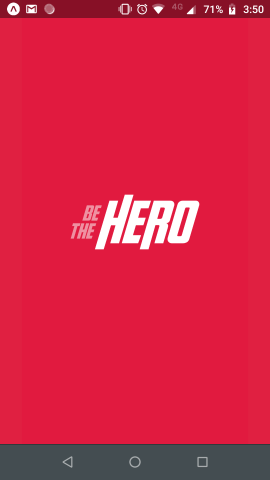
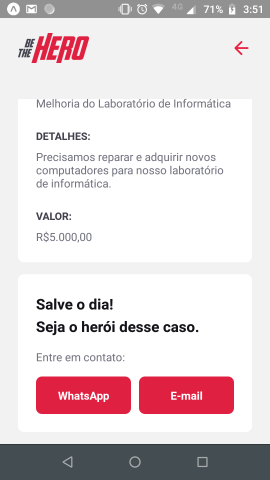

# Aplicativo para doações a ONGs

  

Plataforma Web para que ONGs se registrem e cadastrem suas necessidades a fim de que qualquer pessoa utilizando o App Mobile (Android/IOs) possa entrar em contato e fazer doações para cada caso.

É um projeto simples desenvolvido durante a 11ª semana OminiStack, promovida pela Rocketseat em Março/2020.

Neste arquivo você encontrará instruções para instalação, imagens demonstrativas e também tecnologias utilizadas nesta aplicação.

[Demo #1](demo/demo1.png) - [Demo #2](demo/demo2.png) - [Demo #3](demo/demo3.png) - [Demo #4](demo/demo4.png) - [Demo #5](demo/demo5.png) - [Demo #6](demo/demo6.png) - [Demo #7](demo/demo7.png)

## Primeiros Passos

Siga estas instruções para ter uma cópia do projeto funcionando em seu computador.

### Pré-requisitos

O que você precisará:

```
Node.js
NPM
```

### Instalando

Siga os passos a seguir para rodar esta aplicação em seu computador.

#### Obtendo uma cópia

Faça o download, use uma ferramente Git ou a própria IDE de sua preferência para clonar este repositório. Há 3 projetos neste repositório, separados nas respectivas pastas `backend` (projeto Node), `frontend` (projeto React), `mobile` (projeto React Native).

### Executando

#### Inicialização do banco de dados:

No diretório do projeto `backend` executar o comando:

```
knex migrate:latest
```

#### Inicialização dos projetos:

O comando abaixo deve ser executado no diretório de cada um dos projetos que se deseja iniciar:

```
npm start
```

> Para o correto funcionamento dos projetos `frontend` e `mobile` é necessário iniciar o projeto `backend`.

## Demonstração

#### Acessando a aplicação Web

Acesse localhost:3000 para usar a aplicação Web no computador. Nesta aplicação é possível registrar ONGs e gerenciar seus casos.

Para acessar a área privada da aplicação é preciso ter um usuário:

```
Clique em 'Não tenho registro'
Informe dados fictícios para criar uma ONG e clique em 'Cadastrar'
Copie o ID de acesso
```

Acesse a área privada:

```
Informe o ID da ONG
Clique em 'Entrar'
```

Utilização:

```
Vá em Cadastrar novo caso → Crie um novo caso
Para excluir casos, clique no ícone de 'Lixeira'
```


#### Acessando o App Mobile

Acesse localhost:19002. Este console permite simular ou abrir o aplicativo diretamente em um celular conectado através das opções no menu lateral.

#### Capturas de tela

[Demo #1](demo/demo1.png) - [Demo #2](demo/demo2.png) - [Demo #3](demo/demo3.png) - [Demo #4](demo/demo4.png) - [Demo #5](demo/demo5.png) - [Demo #6](demo/demo6.png) - [Demo #7](demo/demo7.png)

## Tecnologias utilizadas

* [NodeJS](https://nodejs.org/) - Interpretador de JavaScript para servidores
* [React](https://reactjs.org/) - Bibliotea JavaScript para interfaces de usuário em páginas Web
* [React Native](https://reactnative.dev/) - Bibliotea JavaScript para criação de aplicativos nativos Android e IOs
* [Express](https://expressjs.com/pt-br/) - Framwork para aplicações Web NodeJS
* [Nodemon](https://nodemon.io/) - Utilitário para desenvolvimento em NodeJS
* [Knex](http://knexjs.org/) - Um construtor de SQL/DDL para NodeJS
* [Celebrate](https://www.npmjs.com/package/celebrate) - Middleware para validação de dados usando Joi
* [Joi](https://hapi.dev/module/joi/) - Biblioteca para validação de dados
* [Jest](https://jestjs.io/pt-BR/) - Framework de Testes em JavaScript
* [Axios](https://github.com/axios/axios) - Cliente HTTP/Rest para NodeJS
* [Expo](https://expo.io/) - Ferramenta para desenvolvimento mobile com React
* [SQLite](https://www.sqlite.org/) - Banco de dados relacional embutido

## Autor

Steffan Martins Alves - Criação - [LinkedIn](https://www.linkedin.com/in/steffanmartins/)

## Licença

Este projeto está licenciado sob a GNU Affero General Public License v3.0 - leia [LICENSE.md](LICENSE.md) para mais detalhes.